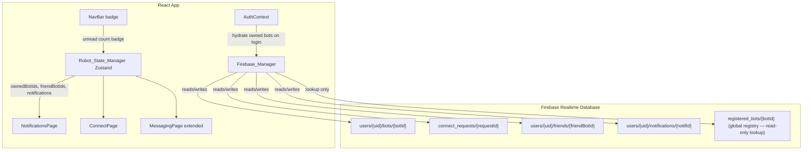
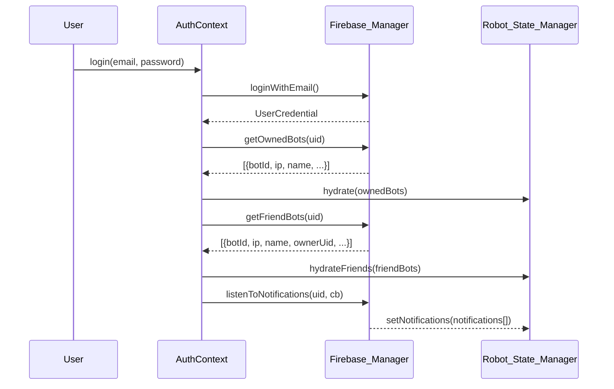
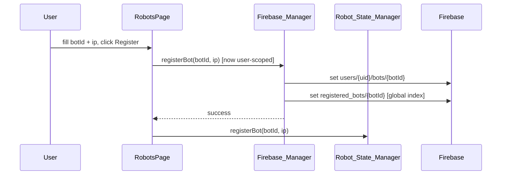
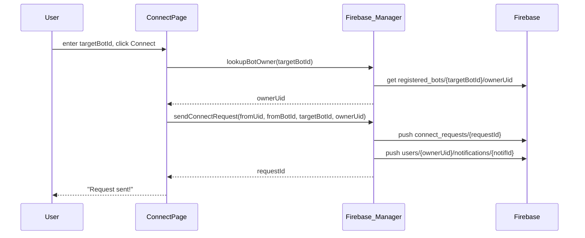
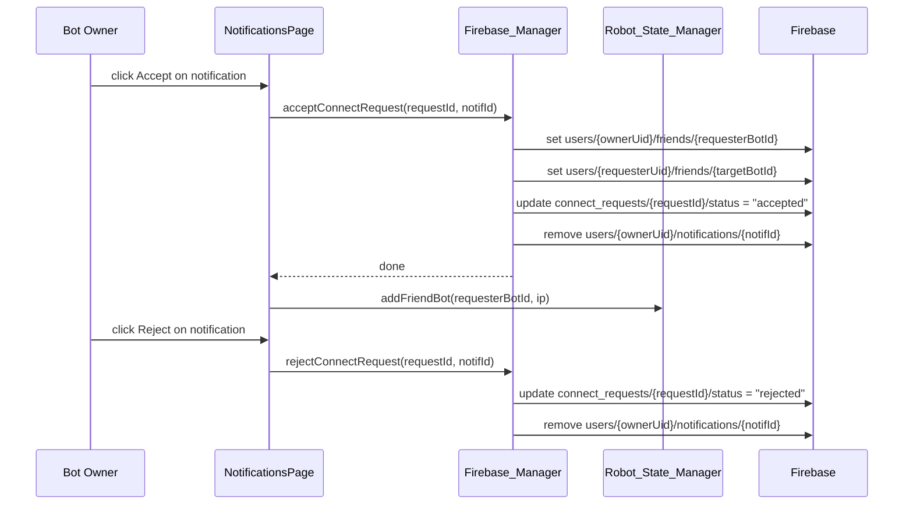

# Design Document: Bot Social Ownership

## Overview

This feature adds user-scoped bot ownership, a friend-request / connect system between bots, and a real-time notifications panel to the DexBot web dashboard. Each authenticated user sees only their own registered bots; they can search for another user's bot by Bot ID, send a connect request, and — once accepted — chat with that friend bot through the existing Messaging page. The implementation is fully backward-compatible: all Firebase calls continue to flow through `Firebase_Manager`, state lives in Zustand (`useRobotStore`), and new UI follows the existing `GlassCard` / `NeonButton` / Framer Motion patterns.

---

## Architecture



---

## Sequence Diagrams

### 1 — Login & Bot Hydration (Owned Bots)



### 2 — Register a New Bot (User-Scoped)



### 3 — Send Connect Request



### 4 — Accept / Reject Connect Request



---

## Firebase Data Model

### New / Modified Paths

```
registered_bots/{botId}
  ip:           string
  name:         string
  ownerUid:     string          ← NEW: links bot to its owner
  registeredAt: number

users/{uid}/bots/{botId}        ← NEW: user-scoped bot list
  ip:           string
  name:         string
  registeredAt: number

users/{uid}/friends/{friendBotId}   ← NEW
  ip:           string
  name:         string
  ownerUid:     string
  addedAt:      number

connect_requests/{requestId}    ← NEW
  fromUid:      string
  fromBotId:    string
  toBotId:      string
  toOwnerUid:   string
  status:       "pending" | "accepted" | "rejected"
  createdAt:    number

users/{uid}/notifications/{notifId}   ← NEW
  type:         "connect_request"
  requestId:    string
  fromUid:      string
  fromBotId:    string
  toBotId:      string
  senderName:   string          (display name of requester)
  createdAt:    number
  read:         boolean
```

### Migration Note

Existing `registered_bots/{botId}` entries do not have `ownerUid`. The new `registerBot` method writes `ownerUid`; existing bots remain accessible globally but will not appear in any user's owned list until re-registered or migrated. A one-time migration helper (`Firebase_Manager.migrateBotsToUser(uid, botIds)`) is provided for existing users.

---

## Components and Interfaces

### Component 1: `ConnectPage` (`src/pages/ConnectPage.jsx`)

**Purpose**: Lets a user search for a bot by ID and send a connect request to its owner.

**Interface**:
```typescript
// No props — reads uid from useAuth(), owned bots from useRobotStore
function ConnectPage(): JSX.Element
```

**Responsibilities**:
- Input field for target Bot ID
- "Search" button → calls `Firebase_Manager.lookupBotOwner(botId)`
- Shows bot info card if found (name, owner display name)
- "Send Connect Request" button → calls `Firebase_Manager.sendConnectRequest(...)`
- Shows pending/sent state to prevent duplicate requests
- Displays error if bot not found or request already sent

---

### Component 2: `NotificationsPage` (`src/pages/NotificationsPage.jsx`)

**Purpose**: Shows incoming connect requests with Accept / Reject actions.

**Interface**:
```typescript
function NotificationsPage(): JSX.Element
```

**Responsibilities**:
- Reads `notifications` from Zustand store (real-time via listener set up in `AuthContext`)
- Renders each notification as a `GlassCard` with sender info and two `NeonButton`s
- Accept → calls `Firebase_Manager.acceptConnectRequest(requestId, notifId, ...)`
- Reject → calls `Firebase_Manager.rejectConnectRequest(requestId, notifId)`
- Empty state when no notifications
- Unread badge count reflected in NavBar

---

### Component 3: `NotificationBadge` (`src/components/ui/NotificationBadge.jsx`)

**Purpose**: Small red dot / count badge shown on the NavBar notifications link.

**Interface**:
```typescript
interface NotificationBadgeProps {
  count: number   // unread notification count
}
function NotificationBadge({ count }: NotificationBadgeProps): JSX.Element | null
```

---

### Component 4: Updated `NavBar`

**Changes**:
- Add two new nav items: `{ to: '/connect', icon: UserPlus, label: 'Connect' }` and `{ to: '/notifications', icon: Bell, label: 'Notifications' }`
- Wrap the Notifications nav item with `NotificationBadge` showing unread count from Zustand

---

### Component 5: Updated `MessagingPage`

**Changes**:
- Bot selector sidebar now shows two sections: **My Bots** (owned) and **Friend Bots** (from `useFriendBotIds()`)
- Friend bots are selectable as message targets
- No changes to the actual send/receive logic

---

## Data Models

### `OwnedBot`
```typescript
interface OwnedBot {
  botId:        string
  ip:           string
  name:         string
  registeredAt: number
}
```

### `FriendBot`
```typescript
interface FriendBot {
  botId:    string
  ip:       string
  name:     string
  ownerUid: string
  addedAt:  number
}
```

### `ConnectRequest`
```typescript
interface ConnectRequest {
  requestId:  string
  fromUid:    string
  fromBotId:  string
  toBotId:    string
  toOwnerUid: string
  status:     'pending' | 'accepted' | 'rejected'
  createdAt:  number
}
```

### `Notification`
```typescript
interface Notification {
  notifId:     string
  type:        'connect_request'
  requestId:   string
  fromUid:     string
  fromBotId:   string
  toBotId:     string
  senderName:  string
  createdAt:   number
  read:        boolean
}
```

**Validation Rules**:
- `botId` must be non-empty, alphanumeric + hyphens/underscores only
- `ip` must match IPv4 pattern or hostname
- A user cannot send a connect request to their own bot
- Duplicate pending requests (same `fromBotId` + `toBotId`) are rejected client-side

---

## Algorithmic Pseudocode

### Main Hydration Algorithm (AuthContext on login)

```pascal
ALGORITHM hydrateUserData(uid)
INPUT: uid — authenticated user's Firebase UID
OUTPUT: side-effects on Zustand store

BEGIN
  // 1. Load owned bots
  ownedBots ← Firebase_Manager.getOwnedBots(uid)
  useRobotStore.hydrate(ownedBots)

  // 2. Load friend bots
  friendBots ← Firebase_Manager.getFriendBots(uid)
  useRobotStore.hydrateFriends(friendBots)

  // 3. Start real-time notification listener
  unsubNotif ← Firebase_Manager.listenToNotifications(uid, (notifs) =>
    useRobotStore.setNotifications(notifs)
  )

  RETURN unsubNotif  // stored in AuthContext for cleanup on logout
END
```

**Preconditions:**
- `uid` is non-null (user is authenticated)
- Firebase SDK is initialized

**Postconditions:**
- `useRobotStore.registeredBotIds` contains only the current user's owned bot IDs
- `useRobotStore.friendBotIds` contains accepted friend bot IDs
- `useRobotStore.notifications` is kept in sync via real-time listener

---

### Send Connect Request Algorithm

```pascal
ALGORITHM sendConnectRequest(fromUid, fromBotId, targetBotId)
INPUT: fromUid, fromBotId — requester's identity; targetBotId — target bot
OUTPUT: requestId string OR error

BEGIN
  // 1. Validate not self-request
  IF fromBotId EQUALS targetBotId THEN
    THROW Error("Cannot connect to your own bot")
  END IF

  // 2. Look up target bot's owner
  ownerData ← Firebase_Manager.lookupBotOwner(targetBotId)
  IF ownerData IS NULL THEN
    THROW Error("Bot not found")
  END IF

  toOwnerUid ← ownerData.ownerUid

  IF toOwnerUid EQUALS fromUid THEN
    THROW Error("Cannot connect to your own bot")
  END IF

  // 3. Check for existing pending request
  existing ← Firebase_Manager.findPendingRequest(fromBotId, targetBotId)
  IF existing IS NOT NULL THEN
    THROW Error("Request already pending")
  END IF

  // 4. Write connect request
  requestId ← Firebase_Manager.sendConnectRequest(
    fromUid, fromBotId, targetBotId, toOwnerUid
  )

  RETURN requestId
END
```

**Preconditions:**
- User is authenticated
- `fromBotId` is owned by `fromUid`
- `targetBotId` exists in `registered_bots`

**Postconditions:**
- `connect_requests/{requestId}` created with `status = "pending"`
- `users/{toOwnerUid}/notifications/{notifId}` created
- Requester sees "Request sent" confirmation

---

### Accept Connect Request Algorithm

```pascal
ALGORITHM acceptConnectRequest(requestId, notifId, ownerUid)
INPUT: requestId, notifId — identifiers; ownerUid — current user's UID
OUTPUT: side-effects (mutual friend links created)

BEGIN
  // 1. Fetch request details
  request ← Firebase_Manager.getConnectRequest(requestId)

  IF request IS NULL OR request.status NOT EQUALS "pending" THEN
    THROW Error("Request no longer valid")
  END IF

  // 2. Create mutual friend entries (atomic-ish via Promise.all)
  PARALLEL DO
    // Owner gains requester's bot as friend
    Firebase_Manager.addFriend(ownerUid, request.fromBotId, request.fromUid)

    // Requester gains owner's bot as friend
    Firebase_Manager.addFriend(request.fromUid, request.toBotId, ownerUid)

    // Update request status
    Firebase_Manager.updateRequestStatus(requestId, "accepted")

    // Remove notification
    Firebase_Manager.removeNotification(ownerUid, notifId)
  END PARALLEL

  // 3. Update local Zustand store
  useRobotStore.addFriendBot(request.fromBotId, request.fromUid)
END
```

**Preconditions:**
- `ownerUid` matches `request.toOwnerUid`
- Request status is `"pending"`

**Postconditions:**
- Both users have mutual friend entries
- Notification is removed
- Request status is `"accepted"`
- Friend bot appears in both users' Messaging page

---

## Key Functions with Formal Specifications

### `Firebase_Manager.getOwnedBots(uid)`

```typescript
async getOwnedBots(uid: string): Promise<OwnedBot[]>
```

**Preconditions:**
- `uid` is non-empty string
- Firebase DB is initialized

**Postconditions:**
- Returns array (possibly empty) of bots owned by `uid`
- Each entry has `botId`, `ip`, `name`, `registeredAt`
- Does NOT return bots owned by other users

**Loop Invariants:** N/A (single `get` call, no loops)

---

### `Firebase_Manager.registerBot(botId, ip)` (updated)

```typescript
async registerBot(botId: string, ip: string): Promise<void>
```

**Preconditions:**
- User is authenticated (`_auth.currentUser` is non-null)
- `botId` matches `/^[a-zA-Z0-9_-]+$/`
- `ip` is non-empty

**Postconditions:**
- `users/{uid}/bots/{botId}` is written with `{ ip, name: botId, registeredAt }`
- `registered_bots/{botId}` is written with `{ ip, name: botId, ownerUid: uid, registeredAt }`
- Both writes succeed atomically (Promise.all)

---

### `Firebase_Manager.lookupBotOwner(botId)`

```typescript
async lookupBotOwner(botId: string): Promise<{ ownerUid: string, name: string } | null>
```

**Preconditions:**
- `botId` is non-empty

**Postconditions:**
- Returns `{ ownerUid, name }` if bot exists in `registered_bots`
- Returns `null` if bot not found
- No side effects

---

### `Firebase_Manager.sendConnectRequest(fromUid, fromBotId, toBotId, toOwnerUid)`

```typescript
async sendConnectRequest(
  fromUid: string,
  fromBotId: string,
  toBotId: string,
  toOwnerUid: string
): Promise<string>  // returns requestId
```

**Preconditions:**
- All parameters are non-empty strings
- `fromUid !== toOwnerUid`

**Postconditions:**
- New entry at `connect_requests/{requestId}` with `status = "pending"`
- New entry at `users/{toOwnerUid}/notifications/{notifId}` with `type = "connect_request"`
- Returns the generated `requestId`

---

### `Firebase_Manager.acceptConnectRequest(requestId, notifId, ownerUid)`

```typescript
async acceptConnectRequest(
  requestId: string,
  notifId: string,
  ownerUid: string
): Promise<void>
```

**Preconditions:**
- `requestId` exists and has `status = "pending"`
- `ownerUid` matches `request.toOwnerUid`

**Postconditions:**
- `users/{ownerUid}/friends/{fromBotId}` created
- `users/{fromUid}/friends/{toBotId}` created
- `connect_requests/{requestId}/status` = `"accepted"`
- `users/{ownerUid}/notifications/{notifId}` removed

---

### `Firebase_Manager.rejectConnectRequest(requestId, notifId, ownerUid)`

```typescript
async rejectConnectRequest(
  requestId: string,
  notifId: string,
  ownerUid: string
): Promise<void>
```

**Preconditions:**
- `requestId` exists and has `status = "pending"`

**Postconditions:**
- `connect_requests/{requestId}/status` = `"rejected"`
- `users/{ownerUid}/notifications/{notifId}` removed
- No friend entries created

---

### `Firebase_Manager.listenToNotifications(uid, callback)`

```typescript
listenToNotifications(
  uid: string,
  callback: (notifications: Notification[]) => void
): () => void  // unsubscribe
```

**Preconditions:**
- `uid` is non-empty
- `callback` is a function

**Postconditions:**
- Fires `callback` immediately with current notifications
- Fires `callback` on every subsequent change to `users/{uid}/notifications`
- Returns unsubscribe function that detaches the listener

---

### `Firebase_Manager.getFriendBots(uid)`

```typescript
async getFriendBots(uid: string): Promise<FriendBot[]>
```

**Preconditions:**
- `uid` is non-empty

**Postconditions:**
- Returns array of friend bots for `uid`
- Each entry has `botId`, `ip`, `name`, `ownerUid`, `addedAt`

---

### `Firebase_Manager.migrateBotsToUser(uid, botIds)`

```typescript
async migrateBotsToUser(uid: string, botIds: string[]): Promise<void>
```

**Preconditions:**
- `uid` is non-empty
- `botIds` is a non-empty array

**Postconditions:**
- For each `botId` in `botIds`: writes `users/{uid}/bots/{botId}` and updates `registered_bots/{botId}/ownerUid = uid`
- Idempotent — safe to call multiple times

**Loop Invariants:**
- All previously processed bots have been written before the next iteration begins

---

## Zustand Store Changes (`Robot_State_Manager.js`)

### New State Fields

```typescript
// Added to the store shape:
friendBotIds:   string[]          // accepted friend bot IDs
notifications:  Notification[]    // real-time notification list
```

### New Actions

```pascal
PROCEDURE hydrateFriends(friendBots: FriendBot[])
  FOR each { botId, ip } IN friendBots DO
    IF botId NOT IN robots THEN
      robots[botId] ← createDefaultRobotState(botId, ip)
    END IF
    IF botId NOT IN friendBotIds THEN
      friendBotIds.push(botId)
    END IF
  END FOR
END PROCEDURE

PROCEDURE addFriendBot(botId: string, ip: string)
  IF botId NOT IN robots THEN
    robots[botId] ← createDefaultRobotState(botId, ip)
  END IF
  friendBotIds ← unique([...friendBotIds, botId])
END PROCEDURE

PROCEDURE removeFriendBot(botId: string)
  friendBotIds ← friendBotIds.filter(id => id !== botId)
  // Note: does NOT remove from robots map (bot may still be in registry)
END PROCEDURE

PROCEDURE setNotifications(notifications: Notification[])
  notifications ← notifications sorted by createdAt DESC
END PROCEDURE
```

---

## New React Hooks

### `useFriendBotIds()`

```typescript
// src/hooks/useRobotState.js  (added export)
function useFriendBotIds(): string[]
// Returns useRobotStore(s => s.friendBotIds)
```

### `useNotifications()`

```typescript
// src/hooks/useNotifications.js  (new file)
function useNotifications(): {
  notifications: Notification[]
  unreadCount: number
}
// Selects notifications from Zustand; unreadCount = notifications.filter(n => !n.read).length
```

---

## Example Usage

```typescript
// ConnectPage — search and send request
const { currentUser } = useAuth()
const ownedBotIds = useRegisteredBotIds()

const handleConnect = async () => {
  const owner = await Firebase_Manager.lookupBotOwner(targetBotId)
  if (!owner) { showToast('Bot not found', 'error'); return }

  const requestId = await Firebase_Manager.sendConnectRequest(
    currentUser.uid,
    selectedOwnBotId,
    targetBotId,
    owner.ownerUid
  )
  showToast('Connect request sent!', 'success')
}

// NotificationsPage — accept a request
const { notifications } = useNotifications()
const { currentUser } = useAuth()

const handleAccept = async (notif) => {
  await Firebase_Manager.acceptConnectRequest(
    notif.requestId,
    notif.notifId,
    currentUser.uid
  )
  useRobotStore.getState().addFriendBot(notif.fromBotId, resolvedIp)
  showToast('Bot connected!', 'success')
}

// MessagingPage — combined bot list
const ownedIds = useRegisteredBotIds()   // my bots
const friendIds = useFriendBotIds()      // friend bots
const allTargets = [...ownedIds, ...friendIds]
```

---

## Route Additions (`App.jsx`)

```typescript
// New lazy imports
const ConnectPage       = lazy(() => import('@/pages/ConnectPage'))
const NotificationsPage = lazy(() => import('@/pages/NotificationsPage'))

// New protected routes (inside the ProtectedRoute block)
<Route path="/connect"       element={<AppLayout><ConnectPage /></AppLayout>} />
<Route path="/notifications" element={<AppLayout><NotificationsPage /></AppLayout>} />
```

---

## NavBar Additions

```typescript
// New nav items added to NAV_ITEMS array
import { UserPlus, Bell } from 'lucide-react'

{ to: '/connect',       icon: UserPlus, label: 'Connect'       },
{ to: '/notifications', icon: Bell,     label: 'Notifications' },

// Notifications item rendered with badge:
// <NavLink to="/notifications" ...>
//   <div className="relative">
//     <Bell className="w-5 h-5 shrink-0" />
//     <NotificationBadge count={unreadCount} />
//   </div>
//   <span className="hidden xl:block text-sm font-medium">Notifications</span>
// </NavLink>
```

---

## Error Handling

### Error Scenario 1: Bot Not Found During Connect Search

**Condition**: User enters a Bot ID that doesn't exist in `registered_bots`
**Response**: `lookupBotOwner` returns `null`; UI shows "Bot not found" toast and clears the result card
**Recovery**: User can try a different Bot ID

### Error Scenario 2: Duplicate Connect Request

**Condition**: User tries to send a second request to the same bot while one is still pending
**Response**: `findPendingRequest` returns existing request; UI shows "Request already pending" toast
**Recovery**: User waits for the owner to accept/reject

### Error Scenario 3: Self-Connect Attempt

**Condition**: User tries to connect to a bot they own
**Response**: Client-side check before any Firebase call; shows "Cannot connect to your own bot" toast
**Recovery**: User selects a different target bot

### Error Scenario 4: Accept/Reject on Stale Notification

**Condition**: Notification was already acted on (e.g., from another browser tab)
**Response**: `acceptConnectRequest` / `rejectConnectRequest` checks request status; if not `"pending"`, shows "Request no longer valid" toast
**Recovery**: Notification is removed from UI; store refreshes via real-time listener

### Error Scenario 5: Firebase Permission Denied

**Condition**: Security rules block a write (e.g., user tries to write to another user's bots)
**Response**: Firebase throws permission error; caught in try/catch; shows "Permission denied" toast
**Recovery**: No partial state written; user is informed

---

## Testing Strategy

### Unit Testing Approach

Test each new `Firebase_Manager` method in isolation using Firebase emulator or mocked `ref`/`set`/`get` calls:
- `getOwnedBots` returns only bots under `users/{uid}/bots`
- `registerBot` writes to both `users/{uid}/bots/{botId}` and `registered_bots/{botId}`
- `sendConnectRequest` creates entries at both `connect_requests` and `users/{toOwnerUid}/notifications`
- `acceptConnectRequest` creates mutual friend entries and removes notification
- `rejectConnectRequest` updates status and removes notification without creating friends

Test Zustand store actions:
- `hydrateFriends` populates `friendBotIds` and `robots` map
- `addFriendBot` adds to `friendBotIds` without duplicates
- `setNotifications` sorts by `createdAt` descending

### Property-Based Testing Approach

**Property Test Library**: `fast-check` (already in `package.json`)

Key properties to verify:
- `hydrateFriends(bots)` → `friendBotIds.length === unique(bots.map(b => b.botId)).length`
- `addFriendBot` is idempotent: calling it twice with the same `botId` does not duplicate `friendBotIds`
- `setNotifications(notifs)` → result is sorted descending by `createdAt` for any input order
- `sendConnectRequest` with `fromUid === toOwnerUid` always throws (self-connect invariant)

### Integration Testing Approach

End-to-end flow tests using Firebase emulator:
1. User A registers bot "bot-A", User B registers bot "bot-B"
2. User A sends connect request to "bot-B"
3. User B sees notification, accepts
4. Both users now have mutual friend entries
5. Both users can select each other's bot in MessagingPage

---

## Performance Considerations

- Notification listener (`listenToNotifications`) is attached once on login and detached on logout — no per-component listeners
- `getFriendBots` is a one-time `get` on login; subsequent changes are handled via the friend list listener (optional enhancement)
- Bot lookup (`lookupBotOwner`) reads a single node — O(1) Firebase read
- `registered_bots` global index is kept lean (only `ip`, `name`, `ownerUid`, `registeredAt`) to minimize read costs
- Notifications are capped at the 50 most recent via `limitToLast(50)` in the listener query

---

## Security Considerations

- **Firebase Security Rules** must be updated to enforce:
  - `users/{uid}/bots` — read/write only by `uid`
  - `users/{uid}/friends` — read/write only by `uid`
  - `users/{uid}/notifications` — read/write only by `uid`
  - `connect_requests/{requestId}` — write by `fromUid`; update (status) by `toOwnerUid`; read by either party
  - `registered_bots/{botId}` — write only by authenticated user who owns the bot (`ownerUid === auth.uid`)
- Bot IDs are validated client-side with `/^[a-zA-Z0-9_-]+$/` before any Firebase write
- `ownerUid` is always set server-side from `_auth.currentUser.uid` — never from user input
- Connect requests cannot be self-directed (enforced both client-side and via security rules)

---

## Dependencies

All dependencies are already present in `package.json`:
- `firebase ^10.8.0` — Realtime Database + Auth
- `zustand ^4.5.0` — state management
- `react-router-dom ^6.22.0` — new routes
- `framer-motion ^11.0.0` — page animations
- `lucide-react ^0.344.0` — `UserPlus`, `Bell` icons (already bundled)
- `fast-check ^3.23.2` — property-based tests

No new dependencies required.

---

## Correctness Properties

*A property is a characteristic or behavior that should hold true across all valid executions of a system — essentially, a formal statement about what the system should do. Properties serve as the bridge between human-readable specifications and machine-verifiable correctness guarantees.*

### Property 1: Ownership Isolation

For all users `u1 ≠ u2`, `getOwnedBots(u1)` and `getOwnedBots(u2)` return disjoint sets. No bot appears in two users' owned lists simultaneously.

**Validates: Requirements 1.6**

### Property 2: Friend Symmetry

For any accepted connect request, if `users/{uid_A}/friends/{botB}` exists then `users/{uid_B}/friends/{botA}` also exists (where `uid_B` is `botB`'s owner). Friendship is always mutual after `acceptConnectRequest` completes.

**Validates: Requirements 4.1**

### Property 3: No Self-Connection

For any connect request where `fromUid === toOwnerUid`, the operation is always rejected before any Firebase write occurs. A user can never be both requester and target owner.

**Validates: Requirements 3.5**

### Property 4: Request Status Monotonicity

For any connect request, the `status` field transitions only in the direction `"pending" → "accepted"` or `"pending" → "rejected"` and never reverts to `"pending"` once resolved.

**Validates: Requirements 3.7**

### Property 5: Notification Cleanup

For any accepted or rejected connect request, the corresponding notification entry at `users/{toOwnerUid}/notifications/{notifId}` is removed. No stale notifications remain after resolution.

**Validates: Requirements 4.2, 4.3**

### Property 6: Idempotent Friend Hydration

For any list of friend bots `F`, calling `hydrateFriends(F)` any number of times results in `friendBotIds` containing exactly the unique bot IDs from `F` — no duplicates regardless of call count.

**Validates: Requirements 5.3**

### Property 7: Owned Bots Scoped to Auth User

For any `uid`, `getOwnedBots(uid)` reads exclusively from `users/{uid}/bots` and never from `registered_bots` directly, ensuring isolation even if the global registry contains bots with no `ownerUid`.

**Validates: Requirements 1.2**

### Property 8: Notification Sort Order

For any list of notifications in any input order, `setNotifications(notifs)` always produces a list sorted by `createdAt` descending.

**Validates: Requirements 2.3**

### Property 9: Bot Registry Consistency

For any valid `botId` and `ip`, after `registerBot(botId, ip)` completes both `users/{uid}/bots/{botId}` and `registered_bots/{botId}` exist and contain matching `ip` and `ownerUid` values.

**Validates: Requirements 1.3**

### Property 10: Friend Bots Visible in Messaging

For all `botId` in `friendBotIds`, `robots[botId]` exists in the Zustand store with at least a default state, making the bot selectable in `MessagingPage` without additional loading steps.

**Validates: Requirements 5.5**

### Property 11: Bot ID Validation Rejects Invalid Inputs

For any string that does not match `/^[a-zA-Z0-9_-]+$/`, bot registration is rejected before any Firebase write occurs.

**Validates: Requirements 1.5**

### Property 12: Duplicate Request Rejection

For any pair `(fromBotId, toBotId)` with an existing pending request, a second `sendConnectRequest` call with the same pair is always rejected without creating a new entry.

**Validates: Requirements 3.6**
